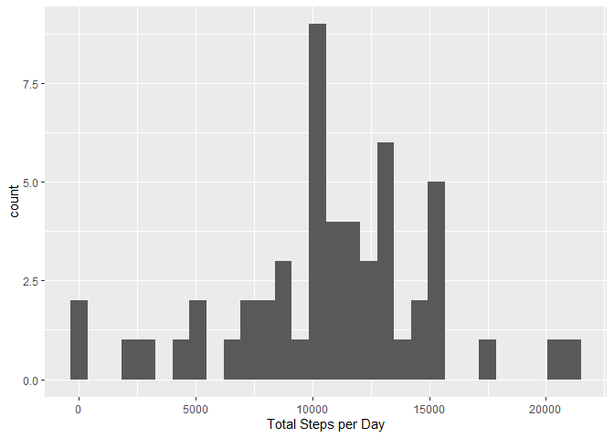
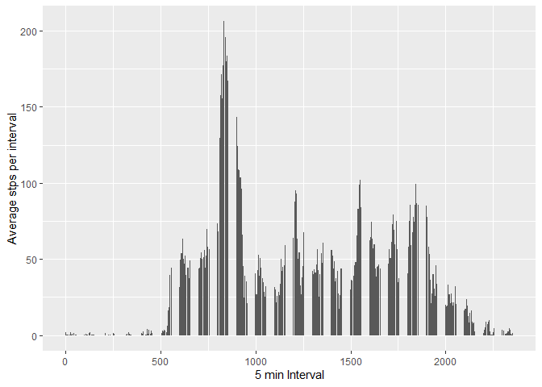
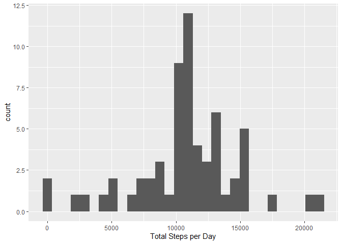
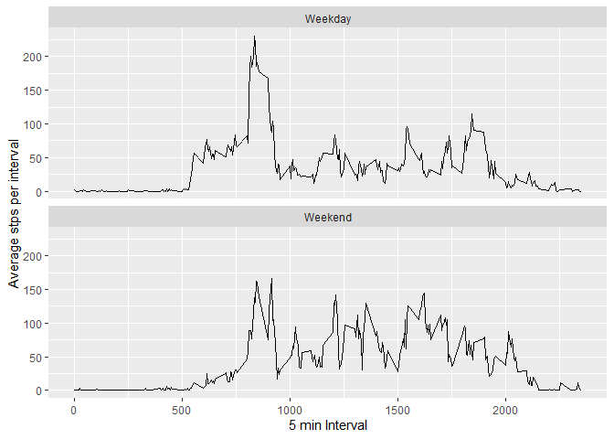

# Load data and libraries  


```r
library('ggplot2')
library('scales')
library('dplyr')
```

```
## 
## Attaching package: 'dplyr'
```

```
## The following objects are masked from 'package:stats':
## 
##     filter, lag
```

```
## The following objects are masked from 'package:base':
## 
##     intersect, setdiff, setequal, union
```

```r
library('readr')
```

```
## 
## Attaching package: 'readr'
```

```
## The following object is masked from 'package:scales':
## 
##     col_factor
```

```r
df <- readr::read_csv(unzip("activity.zip", "activity.csv"))
```

```
## Rows: 17568 Columns: 3
```

```
## -- Column specification --------------------------------------------------------
## Delimiter: ","
## dbl  (2): steps, interval
## date (1): date
## 
## i Use `spec()` to retrieve the full column specification for this data.
## i Specify the column types or set `show_col_types = FALSE` to quiet this message.
```
Need to convert the date variable to posixct


```r
df$date <- as.POSIXct(df$date, tz = "", "%Y-%m-%d")
```


# What is the total number of steps taken per day?  

Calculate the total number of steps taken per day


```r
df_2 <- aggregate(x = df$steps, by = list(date = df$date), FUN = sum)
```

Make a histogram of the total number of steps taken each day  


```r
g <- ggplot(df_2, aes(x = df_2$x), na.rm = TRUE) + 
  geom_histogram() + 
  xlab("Total Steps per Day")
g
```

```
## `stat_bin()` using `bins = 30`. Pick better value with `binwidth`.
```

<!-- -->

Calculate and report the mean and median of the total number of steps taken per day


```r
mean(df_2$x, na.rm = TRUE)
```

```
## [1] 10766.19
```

```r
median(df_2$x, na.rm = TRUE)
```

```
## [1] 10765
```
# What is the average daily activity pattern?   

Make a time series plot of the 5-minute interval (x-axis) and the average number of steps taken, averaged across all days (y-axis)


```r
df_3 <- aggregate(x = df$steps, by = list(interval = df$interval), FUN = mean, na.rm = TRUE)

p <- ggplot(df_3, aes(x = df_3$interval, y = df_3$x)) + 
  geom_bar(stat = 'identity') + 
  xlab("5 min Interval") +
  ylab("Average stps per interval") +
  scale_y_continuous(label=comma)

p
```

<!-- -->


Which 5-minute interval, on average across all the days in the dataset, contains the maximum number of steps?


```r
df_3 <- df_3[order(df_3$x,decreasing=TRUE),]
head(df_3,1)
```

```
##     interval        x
## 104      835 206.1698
```

# Impute missing values   

1. Calculate and report the total number of missing values in the dataset


```r
sum(is.na(df$steps))
```

```
## [1] 2304
```
2. Devise a strategy for filling in all of the missing values in the dataset. The strategy does not need to be sophisticated. For example, you could use the mean/median for that day, or the mean for that 5-minute interval, etc.

3. Create a new dataset that is equal to the original dataset but with the missing data filled in.

My solution is to replace NAs with the mean for a given 5 minute interval, which we calculated already and saved in df_3 - using the mutate function from dplyr


```r
df_4 <- left_join(df,df_3, by = "interval")

df_4 <- df_4 %>%
  mutate(steps = ifelse(is.na(steps), x, steps))
```
4. Make a histogram of the total number of steps taken each day and Calculate and report the mean and median total number of steps taken per day. Do these values differ from the estimates from the first part of the assignment? What is the impact of imputing missing data on the estimates of the total daily number of steps?


```r
# Repeat the aggregation by day as before
df_5 <- aggregate(x = df_4$steps, by = list(date = df_4$date), FUN = sum)

# Plot the histogram
g <- ggplot(df_5, aes(x = df_5$x)) + 
  geom_histogram() + 
  xlab("Total Steps per Day")

g
```

```
## `stat_bin()` using `bins = 30`. Pick better value with `binwidth`.
```

<!-- -->

```r
mean(df_5$x, na.rm = TRUE)
```

```
## [1] 10766.19
```

```r
median(df_2$x, na.rm = TRUE)
```

```
## [1] 10765
```
Imputing the missing data by using the mean of the 5-minute interval had no effect on the mean, median or distribution of daily steps taken per day

# Are there differences in activity patterns between weekdays and weekends?   

Create a new factor variable in the dataset with two levels – “weekday” and “weekend” indicating whether a given date is a weekday or weekend day.


```r
df_4$wkday <- weekdays(df_4$date)

df_4 <- df_4 %>%
  mutate(wkday = ifelse(wkday == "Saturday" | wkday == "Sunday", "Weekend", "Weekday"))
```
Make a panel plot containing a time series plot (i.e. type = "l") of the 5-minute interval (x-axis) and the average number of steps taken, averaged across all weekday days or weekend days (y-axis)


```r
df_6 <- aggregate(x = df_4$steps, 
                  by = list(interval = df_4$interval, wkday = df_4$wkday), 
                  FUN = mean, na.rm = TRUE)

p <- ggplot(df_6, aes(x = df_6$interval, y = df_6$x)) + 
  geom_line() + 
  xlab("5 min Interval") +
  ylab("Average stps per interval") +
  scale_y_continuous(label=comma) +
  facet_wrap(~wkday, nrow =2)

p
```

<!-- -->
